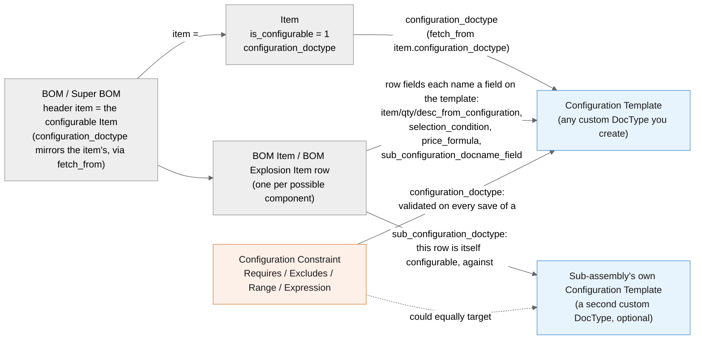
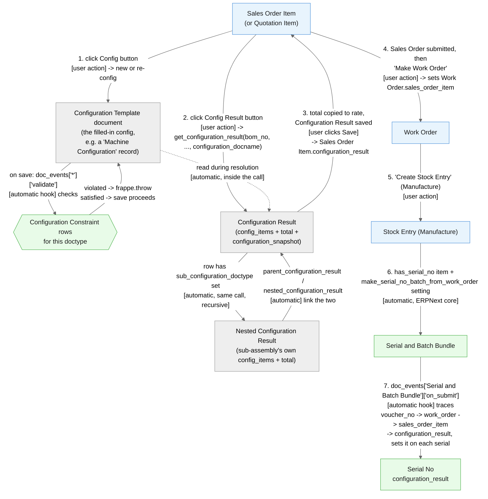

# دليل المستخدم

هذا الدليل موجّه لمن يستخدم الطلبات المُهيَّأة (configured orders) يومياً - موظفي
المبيعات الذين يبنون عرض سعر أو طلباً، وموظفي التصنيع الذين يحوّلونه إلى منتج نهائي.
إذا كنت تُعِدّ التطبيق للمرة الأولى، راجع `docs/setup.md` بدلاً من هذا الدليل.

> **ملاحظة:** أسماء الحقول، الأنواع المستندية (DocTypes)، وأسماء الأزرار تبقى
> بالإنجليزية لأنها النصوص الحرفية التي ستراها على الشاشة تماماً.

## كيف ترتبط هذه الأجزاء ببعضها

**قالب التهيئة (Configuration Template)** هو ببساطة نموذج صممه فريقك التقني (أو
مسؤول النظام) لعائلة منتج واحدة - مثلاً "Machine Configuration" الذي يتضمن حجم
المحرك وجهد لوحة التحكم لاختيارهما. كل شيء آخر في هذا التطبيق موجود لتحويل نسخة
مملوءة من ذلك النموذج إلى قائمة مسعّرة بالقطع اللازمة لبنائه، مع قواعد تمنع
التركيبات المستحيلة من أن تُطلب أصلاً.

بقية هذا الدليل تستعرض كل شاشة بالترتيب الذي ستتعامل معه فعلياً، ثم تتبع طلباً
حقيقياً واحداً من البداية إلى النهاية.

## Item (الصنف)

افتح سجل الصنف الخاص بالمنتج النهائي.

1. اذهب إلى قسم **Variants**.
2. فعّل **Is Configurable**.
3. اضبط **Configuration DocType** على قالب التهيئة الذي يمثل خيارات هذا المنتج
   (مثلاً `Machine Configuration`).

هذا كل ما يخص جانب الصنف - كل شيء آخر يتعلق بـ*أي* المكونات ستظهر يحدث في الـ BOM.

## BOM / Super BOM

ابنِ الـ BOM الخاص بالصنف كالمعتاد، مع سطر واحد لكل مكوّن *يمكن* أن يكون جزءاً من
المنتج النهائي. كل سطر يحتوي على قسم **Configuration** بهذه الحقول - كلها اختيارية،
وتملأ فقط ما ينطبق على ذلك السطر بالتحديد:

- **Item From Configuration** - وجّه هذا الحقل نحو حقل في قالب التهيئة (قائمة
  منسدلة تطابق حقول Data/Select/Link). أياً كان كود الصنف الموجود في مستند تهيئة
  العميل ضمن ذلك الحقل، هو ما سيُدرَج - وكل شيء آخر له نفس قيمة "Item From
  Configuration" يُستبعد. استخدم هذا لحالة "اختر واحداً من هذه الخيارات."
- **Qty From Configuration** - يشير إلى حقل Float/Int في القالب؛ قيمة العميل هناك
  تحل محل كمية هذا السطر الثابتة.
- **Desc From Configuration** - يشير إلى حقل Data/Select/Link؛ يستبدل وصف هذا
  السطر بنص العميل.
- **Selection Condition** - تعبير Python (مستند التهيئة متاح باسم `doc`)، مثل
  `doc.motor_type == '5HP'`. استخدم هذا عندما لا يكفي ربط بسيط "الحقل يساوي قيمة."
- **Price Formula** - تعبير Python يستبدل السعر العادي لهذا السطر، مثل
  `doc.length * doc.width * 10` لصفيحة مقصوصة حسب الطلب مسعّرة بالمساحة. الكمية
  المحسوبة للسطر (`qty`) متاحة أيضاً إذا كان السعر يعتمد عليها فعلياً.
- **Sub Configuration Doctype** / **Sub Configuration Docname Field** - املأ
  الاثنين إذا كان *هذا المكوّن* بحد ذاته تجميعاً فرعياً (sub-assembly) له تهيئته
  الخاصة (BOM خاص به، وقالب تهيئة خاص به). انظر "Configuration Result" أدناه
  لمعرفة ما ينتج عن ذلك.

**اترك كل حقول قسم Configuration فارغة** في سطر معين لجعل ذلك المكوّن إلزامياً في
كل عملية بناء، بغض النظر عن اختيارات العميل.

قدّم (Submit) الـ BOM وحدّده كـ **Is Default** للصنف.

## Configuration Template (قالب التهيئة)

بالنسبة لك، قالب التهيئة هو ببساطة النموذج الذي يسجّل ما يريده العميل - ليس له شكل
ثابت، لأن مسؤول النظام صممه خصيصاً لمنتجك. بالنسبة لآلة، قد يكون حجم المحرك وجهد
اللوحة؛ بالنسبة لنافذة، قد يكون العرض والارتفاع ونوع الزجاج. تملأه مرة واحدة لكل
طلب (انظر "Sales Order Item" أدناه)؛ القيم التي تدخلها هي ما يحدد أي مكونات الـ
BOM ستُدرج، وبأي كمية، وبأي سعر.

## Configuration Constraint (قيد التهيئة)

هذه هي الطريقة التي يمنع بها مسؤول النظام (أو أنت، إن كانت لديك الصلاحية) حفظ
التركيبات المستحيلة - **دون أن يكتب أحد أي كود.**

افتح **Configuration Constraint** -> New:

- **Configuration Doctype**: أي قالب تهيئة ينطبق عليه هذا القيد.
- **Constraint Type**:
  - **Requires** - إذا طابق حقل قيمة معينة، يجب أن يطابق حقل آخر قيمة معينة أيضاً
    (مثلاً محرك 5HP يتطلب لوحة 380V أو 415V).
  - **Excludes** - إذا طابق حقل قيمة معينة، يجب أن *لا* يطابق حقل آخر قيمة معينة.
  - **Range** - حقل رقمي يجب أن يبقى ضمن حد أدنى وأقصى.
  - **Expression** - أي شيء لا تستطيع الأنواع الثلاثة أعلاه التعبير عنه، كشرط
    Python خام (مستند التهيئة متاح باسم `doc`).
- **Message** - ما يراه المستخدم إذا خالف هذه القاعدة. اتركه فارغاً لرسالة عامة.
- ألغِ تفعيل **Is Active** لتعطيل قاعدة دون حذفها.

**متى تلجأ إلى Expression:** إذا احتاجت قاعدتك أكثر من مقارنة واحدة، أو احتاجت
عمليات حسابية، أو احتاجت مقارنة حقلين ببعضهما بدلاً من مقارنة حقل بقيمة ثابتة -
أي شيء لا تستطيع Requires/Excludes/Range التعبير عنه في خطوة واحدة من نوع
`field operator value`.

يتحقق النظام من أن `if_field`/`then_field`/`range_field` التي تختارها موجودة
فعلاً في قالب التهيئة المستهدف، ويرفض الحفظ فوراً إذا أخطأت في كتابة أحدها،
لذا ستعرف على الفور إذا كانت القاعدة غير مُعدّة بشكل صحيح، بدلاً من اكتشاف ذلك
لاحقاً عندما لا يتصرف طلب أحد العملاء كما هو متوقع بصمت.

## Sales Order Item / Quotation Item

بمجرد إضافة صنف قابل للتهيئة إلى Sales Order أو Quotation، يظهر قسم
**Configuration** على ذلك السطر بزرّين.

**زر Config:**

1. اضغط **Config**.
2. اختر **New Config** لبدء تهيئة جديدة، أو ألغِ تفعيله واختر تهيئة موجودة (قابلة
   للبحث برقم الطلب أو اسم التهيئة) لعمل **re-config** - أي نسخ تهيئة عميل موجودة
   كنقطة بداية لهذا الطلب بدلاً من البدء من الصفر.
3. ستُنقل إلى نموذج قالب التهيئة. املأه (أو عدّل النسخة) واحفظ.
4. ستعود إلى سطر الطلب، مرتبطاً الآن بمستند التهيئة ذاك.

**زر Config Result** (له معنى فقط بعد إتمام Config):

1. اضغط **Config Result**.
2. اختر **Super BOM** لاستخراج البيانات مقابله (الافتراضي هو الـ BOM الافتراضي
   للصنف) وحدد ما إذا كنت تريد **Use Multi Level BOM** (تفكيك التجميعات الفرعية
   من مستويات الـ BOM نفسه، وهذا منفصل عن ميزة التهيئة الفرعية sub-configuration
   الموضحة أدناه).
3. إذا كان أي مكوّن في ذلك الـ BOM تجميعاً فرعياً مُهيَّأً بحد ذاته، سترى حقلاً
   إضافياً لكل مكوّن كهذا - اختر أو أنشئ مستند تهيئته هنا.
4. اضغط **Make Configuration Result**. ستُنقل إلى **Configuration Result** الناتج
   - راجعه (انظر أدناه)، عدّل إذا لزم، واحفظ.
5. في سطر الطلب، يُنسخ إجمالي النتيجة إلى حقل السعر (rate) الخاص بالسطر.

## Configuration Result

هذا هو التفصيل المسعّر: سطر واحد لكل مكوّن من الـ BOM أُدرج فعلياً لهذه التهيئة
المحددة، مع الكمية والسعر والمبلغ. **Total** هو مجموع كل الأسطر.

إذا كان مكوّن أحد الأسطر تجميعاً فرعياً مُهيَّأً بحد ذاته، سيُظهر ذلك السطر رابط
**Nested Configuration Result** - اضغط عليه لفتح Configuration Result *الخاص* بذلك
التجميع الفرعي، بأسطره وإجماليه الخاصين (وهو ما تم تجميعه صعوداً إلى سعر/مبلغ
السطر الذي ضغطت منه). يمكن أن يتداخل هذا لأكثر من مستوى واحد إذا كان الـ BOM لديك
كذلك.

قسم **Configuration Snapshot** (مطوي افتراضياً) يحتفظ بنسخة مجمّدة من قيم حقول
مستند التهيئة في لحظة إنشاء هذه النتيجة - لذا إذا عدّل أحدهم حقول قالب التهيئة
لاحقاً، أو تغيّر مستند التهيئة نفسه، تبقى هذه النتيجة المحفوظة معبّرة عمّا كان
صحيحاً وقت وضع الطلب فعلياً.

## Work Order

بمجرد تقديم (submit) الـ Sales Order، أنشئ Work Order منه كالمعتاد (**Make ->
Work Order**). جدول **Required Items** الخاص به يتضمن فقط المكونات ذات الصلة
الفعلية بتلك التهيئة المحددة للطلب - نفس المنطق الذي بنى Configuration Result،
مُطبَّقاً مرة أخرى مقابل BOM الإنتاج. لن ترى المكونات التي استُبعدت بسبب اختيارات
العميل ضمن قائمة العناصر المطلوبة.

## Serial No

للأصناف ذات الترقيم التسلسلي، بمجرد أن تُنشئ حركة مخزون (Stock Entry) من نوع
Manufacture الخاصة بـ Work Order أرقاماً تسلسلية (Serial No)، يحصل كل رقم على
حقل **Configuration Result** يُضبط تلقائياً - افتح أي Serial No وستجده هناك،
مرتبطاً مباشرة بـ Configuration Result الذي أنتج تلك الوحدة بالذات. اضغط للانتقال
ومعرفة ما طُلب بالضبط: أي خيارات، أي مكونات، بأي سعر.

## سيناريو كامل: آلة صناعية من البداية إلى النهاية

باستخدام مثال "Machine Configuration" من `docs/setup.md` (نوع المحرك، جهد لوحة
التحكم، طول اللوحة)، إليك طلباً واحداً يمر بكل شاشة من الشاشات أعلاه:

1. **Item**: `MACHINE-100` محدد كـ *Is Configurable*، بـ Configuration Doctype
   `Machine Configuration`.
2. **BOM**: الـ Super BOM الخاص بـ `MACHINE-100` يحتوي سطر محرك (`Item From
   Configuration` -> حقل يسمّي الصنف المختار للمحرك)، وسطر لوحة تحكم
   (`Sub Configuration Doctype` = `Panel Configuration`، لأن اللوحة نفسها تُصنع
   حسب الطلب)، وسطر هيكل إلزامي (كل حقوله فارغة).
3. **Configuration Constraint**: قاعدة Requires تمنع اقتران محركات 5HP بلوحة
   220V؛ قاعدة Range تُبقي طول اللوحة بين 50 و200.
4. **Sales Order Item**: أضف `MACHINE-100` إلى Sales Order جديد. اضغط **Config**،
   اختر New Config، اضبط `motor_type = 5HP`، `control_panel_voltage = 380V`،
   `panel_length = 120`، احفظ - تمر قواعد القيد بصمت لأن لا شيء خُولف.
5. اضغط **Config Result**. يُظهر مربع الحوار حقلاً إضافياً لتهيئة لوحة التحكم
   الخاصة بها (لأنها تجميع فرعي) - اختر أو أنشئ واحدة، ثم اضغط
   **Make Configuration Result**.
6. يفتح **Configuration Result**: سطر محرك، سطر لوحة تحكم (برابط
   **Nested Configuration Result** إلى التفصيل المسعّر الخاص باللوحة نفسها)،
   وسطر الهيكل. يُحسب الإجمالي؛ احفظه.
7. عودة إلى Sales Order Item، يُضبط السعر من ذلك الإجمالي. قدّم الـ Sales Order.
8. **Work Order**: أنشئ واحداً من الـ Sales Order. يُظهر Required Items فقط
   المحرك ولوحة التحكم والهيكل - وليس أي أحجام محركات بديلة لم تُختَر.
9. أكمل حركة المخزون الخاصة بالتصنيع. إذا كان لدى `MACHINE-100` (أو أي مكوّن
   ذي ترقيم تسلسلي) أرقام تسلسلية، يحمل كل **Serial No** جديد الآن رابط
   **Configuration Result** يعود إلى تهيئة هذا الطلب بالذات - حتى بعد ستة أشهر،
   مسح ذلك الرقم التسلسلي يخبرك بالضبط بما بُني.

المربعات الزرقاء أعلاه هي أشياء *تضغطها أنت*؛ المربعات الخضراء تحدث تلقائياً بمجرد
إتمامك للخطوة التي تسبقها.
