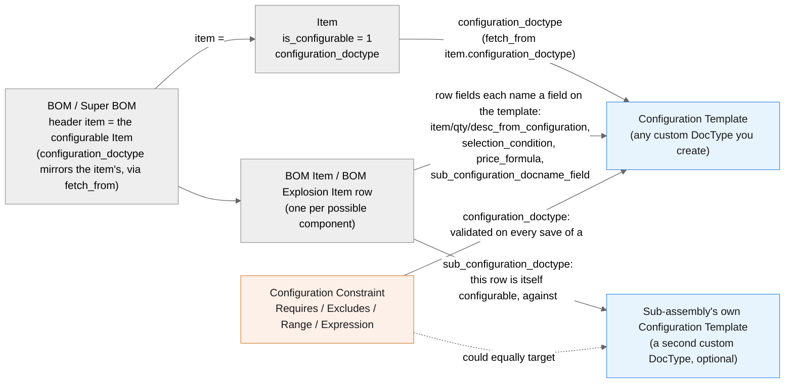
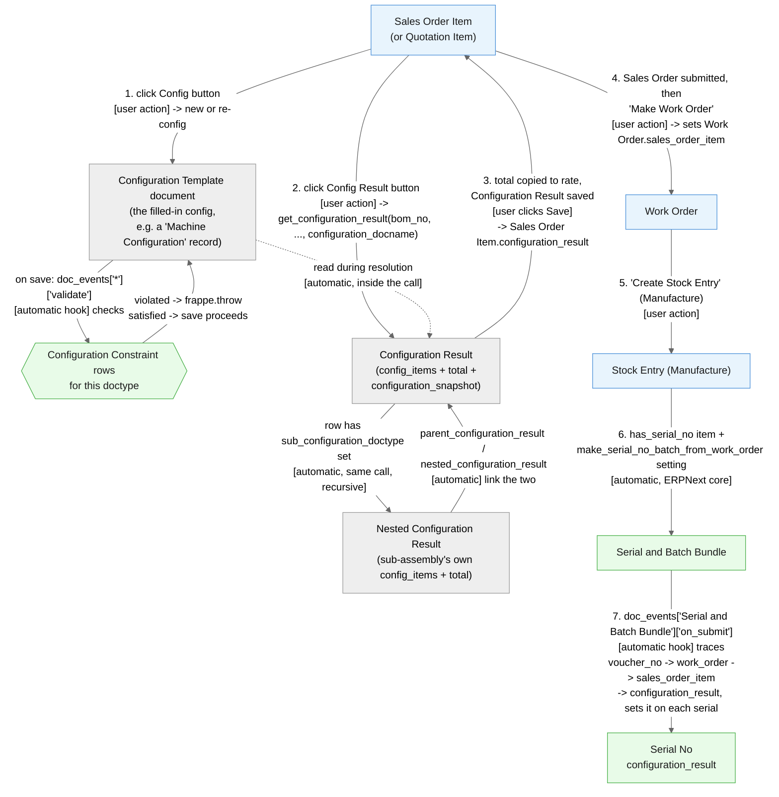

# User Guide

This guide is for the people who use configured orders day to day - sales staff
building a quote or order, and manufacturing staff turning it into a finished product.
If you're setting the app up for the first time, see `docs/setup.md` instead.

## How the pieces fit together

A **Configuration Template** is just a form you (or your admin) designed for one
product family - e.g. "Machine Configuration" with a motor size and a control panel
voltage to pick. Everything else in this app exists to turn a filled-in copy of that
form into a priced list of the parts needed to build it, with rules that stop
impossible combinations from being ordered in the first place.

The rest of this guide walks through each screen in the order you'd normally touch
them, then follows one real order start to finish.

## Item

Open the finished product's Item record.

1. Go to the **Variants** section.
2. Check **Is Configurable**.
3. Set **Configuration DocType** to the Configuration Template that represents this
   product's choices (e.g. `Machine Configuration`).

That's it on the Item side - everything else about *which* components appear happens
on the BOM.

## BOM / Super BOM

Build the item's BOM as normal, with one row per component that *could* be part of
the finished product. Each row has a **Configuration** section with these fields -
all optional, and you only fill in the ones that apply to that specific row:

- **Item From Configuration** - point this at a field on the Configuration Template
  (a dropdown that matches Data/Select/Link fields). Whatever item code the customer's
  configuration document has in that field is the one that gets included - everything
  else with the same "Item From Configuration" value is excluded. Use this for "pick
  one of these options."
- **Qty From Configuration** - points at a Float/Int field on the template; the
  customer's value there overrides this row's plain quantity.
- **Desc From Configuration** - points at a Data/Select/Link field; overrides this
  row's description with the customer's text.
- **Selection Condition** - a Python expression (the configuration document is
  available as `doc`), e.g. `doc.motor_type == '5HP'`. Use this when a simple
  "field equals a value" mapping isn't enough.
- **Price Formula** - a Python expression that replaces this row's normal item price,
  e.g. `doc.length * doc.width * 10` for a custom-cut panel priced by area. `qty` (the
  row's resolved quantity) is also available if the price genuinely depends on it.
- **Sub Configuration Doctype** / **Sub Configuration Docname Field** - fill both in
  if *this component* is itself a separately configured sub-assembly (its own BOM,
  its own Configuration Template). See "Configuration Result" below for what this
  produces.

**Leave every field in the Configuration section blank** on a row to make that
component mandatory in every build, regardless of the customer's choices.

Submit the BOM and mark it **Is Default** for the item.

## Configuration Template

To you, a Configuration Template is just the form that captures what the customer
wants - it has no fixed shape, because your admin designed it for your specific
product. For a machine it might be motor size and panel voltage; for a window it
might be width, height, and glass type. You fill it in once per order (see "Sales
Order Item" below); the fields you enter are what drive which BOM components get
included, in what quantity, and at what price.

## Configuration Constraint

This is how your admin (or you, if you have access) stops impossible combinations
from being saved - **without anyone writing code.**

Open **Configuration Constraint** -> New:

- **Configuration Doctype**: which Configuration Template this rule applies to.
- **Constraint Type**:
  - **Requires** - if one field matches a value, another field must also match
    (e.g. a 5HP motor requires a 380V or 415V panel).
  - **Excludes** - if one field matches a value, another field must *not* match.
  - **Range** - a numeric field must stay within a min/max.
  - **Expression** - anything the three above can't express, as a raw Python
    condition (the configuration document is `doc`).
- **Message** - what the user sees if they violate this rule. Leave it blank for a
  generic message.
- Uncheck **Is Active** to switch a rule off without deleting it.

**When to reach for Expression:** if your rule needs more than one comparison, needs
math, or needs to compare two fields against each other rather than a fixed value -
anything Requires/Excludes/Range can't say in one `field operator value` step.

The system checks your `if_field`/`then_field`/`range_field` actually exist on the
target Configuration Template and rejects the save immediately if you typo one, so
you'll know right away if a rule is misconfigured rather than finding out when a
customer's order silently doesn't behave as expected.

## Sales Order Item / Quotation Item

Once you add a configurable item to a Sales Order or Quotation, a **Configuration**
section appears on that line with two buttons.

**Config button:**

1. Click **Config**.
2. Choose **New Config** to start a fresh configuration, or uncheck it and pick an
   existing one (searchable by order number or configuration name) to **re-config** -
   i.e. copy an existing customer's configuration as the starting point for this
   order instead of starting blank.
3. You're taken to the Configuration Template form. Fill it in (or adjust the copy)
   and save.
4. You're returned to the order line, now linked to that configuration document.

**Config Result button** (only meaningful once Config is done):

1. Click **Config Result**.
2. Pick the **Super BOM** to resolve against (defaults to the item's default BOM) and
   whether to **Use Multi Level BOM** (explode sub-assemblies from the BOM's own
   levels, separate from this app's sub-configuration feature below).
3. If any component on that BOM is itself a configured sub-assembly, you'll see an
   extra field per such component - pick or create its configuration document here.
4. Click **Make Configuration Result**. You're taken to the resulting **Configuration
   Result** - review it (see below), adjust if needed, and save.
5. Back on the order line, the result's total is copied into the line's rate.

## Configuration Result

This is the priced breakdown: one row per BOM component that was actually included
for this specific configuration, with quantity, rate, and amount. The **Total** is
the sum of all rows.

If a row's component is itself a configured sub-assembly, that row shows a **Nested
Configuration Result** link - click it to open that sub-assembly's *own* Configuration
Result, with its own rows and its own total (which is what was rolled up into the
rate/amount of the row you clicked from). This can nest more than one level deep if
your BOM does.

The **Configuration Snapshot** section (collapsed by default) holds a frozen copy of
what the configuration document's fields were at the moment this result was created -
so if someone edits the Configuration Template's fields later, or the configuration
document itself changes, this saved result still reflects what was true when the
order was actually placed.

## Work Order

Once the Sales Order is submitted, create a Work Order from it as usual (**Make ->
Work Order**). Its **Required Items** table only includes the components that were
actually relevant to that order's specific configuration - the same logic that built
the Configuration Result, applied again against the production BOM. You won't see
components excluded by the customer's choices sitting in the required items list.

## Serial No

For serialized items, once a Work Order's Manufacture Stock Entry generates Serial
Nos, each one gets a **Configuration Result** field set automatically - open any
Serial No and you'll find it there, linking straight to the Configuration Result that
produced that specific unit. Click through to see exactly what was ordered: which
options, which components, at what price.

## Walkthrough: an industrial machine, start to finish

Using the "Machine Configuration" example from `docs/setup.md` (motor type, control
panel voltage, panel length), here's one order following every screen above:

1. **Item**: `MACHINE-100` is marked *Is Configurable*, Configuration Doctype
   `Machine Configuration`.
2. **BOM**: the Super BOM for `MACHINE-100` has a Motor row (`Item From
   Configuration` -> a field naming the chosen motor item), a Control Panel row
   (`Sub Configuration Doctype` = `Panel Configuration`, since the panel is itself
   built to order), and a mandatory Chassis row (every field blank).
3. **Configuration Constraint**: a Requires rule blocks 5HP motors from being paired
   with a 220V panel; a Range rule keeps panel length between 50 and 200.
4. **Sales Order Item**: add `MACHINE-100` to a new Sales Order. Click **Config**,
   choose New Config, set `motor_type = 5HP`, `control_panel_voltage = 380V`,
   `panel_length = 120`, save - the constraint rules pass silently since nothing was
   violated.
5. Click **Config Result**. The dialog shows an extra field for the Control Panel's
   own configuration (since it's a sub-assembly) - pick or create one, then click
   **Make Configuration Result**.
6. The **Configuration Result** opens: a Motor row, a Control Panel row (with a
   **Nested Configuration Result** link to the panel's own priced breakdown), and the
   Chassis row. Total is calculated; save it.
7. Back on the Sales Order Item, the rate is set from that total. Submit the Sales
   Order.
8. **Work Order**: create one from the Sales Order. Required Items shows only the
   Motor, Control Panel, and Chassis - not any alternative motor sizes that weren't
   chosen.
9. Complete the manufacturing Stock Entry. If `MACHINE-100` (or any serialized
   component) has serial numbers, each new **Serial No** now carries a
   **Configuration Result** link back to this exact order's configuration - so
   six months from now, scanning that serial tells you exactly what was built.

Blue boxes above are things *you* click; green boxes happen automatically once you've
done the step before them.
